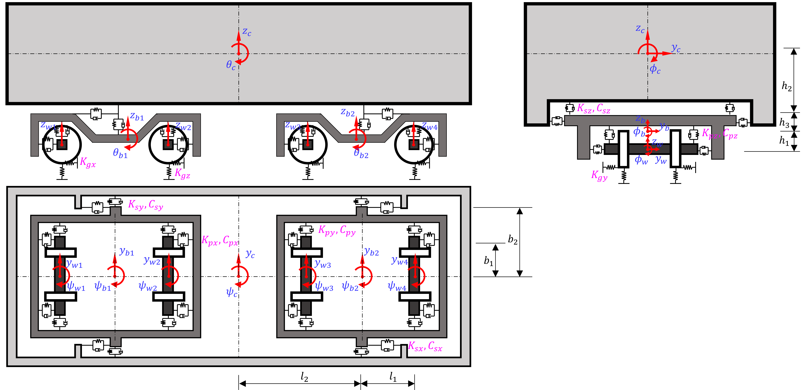

## Construction of the 31-DOF vehicle dynamical model

The full railway vehicle model constructed in this paper is schematically shown as follows, which consists of a car body, two bogies, and four wheelsets. The bogies and car body exhibit five types of motion (lateral, vertical, roll, yaw, and pitch), while the wheelsets have four (lateral, vertical, roll, and yaw).

    

<!-- 

	

![Images/F_vehicle.png]
*Schematic diagram of 31-DOF railway vehicle model* -->

The equation of motion of the train is formulated based on the Lagrangian principle. Here we denote $L$ as the Lagrangian identity, $T$ as the kinetic energy, $V$ as the potential energy, and we have

The kinetic energy of the vehicle system can be expressed as

with

<!-- T_c = \frac{1}{2} \left[m_c(\dot{y}_c^2+\dot{z}_c^2)+I_{cx} \dot{\phi}_c^2+I_{cy} \dot{\theta}_c^2+I_{cz} \dot{\psi}_c^2 \right] -->

<!-- $$
T_b = \sum_{i=1}^2 T_{bi} = \sum_{i=1}^2 \frac{1}{2}\left[m_b(\dot{y}_{bi}^2+\dot{z}_{bi}^2)+I_{bx} \dot{\phi}_{bi}^2+I_{by} \dot{\theta}_{bi}^2+I_{bz} \dot{\psi}_{bi}^2 \right]
$$ -->

<!-- $$
T_w = \sum_{i=1}^4 T_{wi} = \sum_{i=1}^4 \frac{1}{2}\left[m_b(\dot{y}_{wi}^2+\dot{z}_{wi}^2)  + I_{wx} \dot{\phi}_{wi}^2+I_{wz} \dot{\psi}_{wi}^2\right]
$$ -->

The potential energy of the vehicle system can be expressed as

<!-- $$
V = V_s + V_p + V_g
$$ -->

with

$$
V_s = 0.5 k_{sx} \left[\left(\theta_c h_2 + \theta_{b1} h_3 - \psi_c b_2 + \psi_{b1} b_2\right)^2 + \left(\theta_c h_2 + \theta_{b1} h_3 + \psi_c b_2 - \psi_{b1} b_2\right)^2 \right. \\\\
\left.+ \left(\theta_c h_2 + \theta_{b2} h_3 - \psi_c b_2 + \psi_{b2} b_2\right)^2 + \left(\theta_c h_2 + \theta_{b2} h_3 + \psi_c b_2 - \psi_{b2} b_2\right)^2\right] \\\\+ 0.5 k_{sy} \left[\left(y_c - \phi_c h_2 + \psi_c l_2 - y_{b1} - \phi_{b1} h_3\right)^2 + \left(y_c - \phi_c h_2 + \psi_c l_2 - y_{b1} - \phi_{b1} h_3\right)^2 \right.\\\\
\left.+ \left(y_c - \phi_c h_2 - \psi_c l_2 - y_{b2} - \phi_{b2} h_3\right)^2 + \left(y_c - \phi_c h_2 - \psi_c l_2 - y_{b2} - \phi_{b2} h_3\right)^2\right] \ +\\\\ 0.5 k_{sz} \left[\left(z_c - \phi_c b_2 + \theta_c l_2 - z_{b1} + \phi_{b1} b_2\right)^2 + \left(z_c + \phi_c b_2 + \theta_c l_2 - z_{b1} - \phi_{b1} b_2\right)^2 \right.\\\\
\left.+ \left(z_c - \phi_c b_2 - \theta_c l_2 - z_{b2} + \phi_{b2} b_2\right)^2 + \left(z_c + \phi_c b_2 - \theta_c l_2 - z_{b2} - \phi_{b2} b_2\right)^2\right]
$$

and

$$
V_p = 0.5 k_{px} \left[ ( \psi_{b1} b_1 - \theta_{b1} h_1 - \psi_{w1} b_1 )^2 + ( \psi_{b1} b_1 + \theta_{b1} h_1 - \psi_{w1} b_1 )^2 + \right.\\
\left. ( \psi_{b1} b_1 - \theta_{b1} h_1 - \psi_{w2} b_1 )^2 + ( \psi_{b1} b_1 + \theta_{b1} h_1 - \psi_{w2} b_1 )^2 \right.\\
\left.+ ( \psi_{b2} b_1 - \theta_{b2} h_1 - \psi_{w3} b_1 )^2 + ( \psi_{b2} b_1 + \theta_{b2} h_1 - \psi_{w3} b_1 )^2 \right.\\
\left.+ ( \psi_{b2} b_1 - \theta_{b2} h_1 - \psi_{w4} b_1 )^2 + ( \psi_{b2} b_1 + \theta_{b2} h_1 - \psi_{w4} b_1 )^2 \right] \\
+ 0.5 k_{py} \left[ ( y_{b1} - \phi_{b1} h_1 + \psi_{b1} l_1 - y_{w1} )^2 + ( y_{b1} - \phi_{b1} h_1 + \psi_{b1} l_1 - y_{w1} )^2 \right.\\
\left.+ ( y_{b1} - \phi_{b1} h_1 - \psi_{b1} l_1 - y_{w2} )^2 + ( y_{b1} - \phi_{b1} h_1 - \psi_{b1} l_1 - y_{w2} )^2 \right.\\
\left.+ ( y_{b2} - \phi_{b2} h_1 + \psi_{b2} l_1 - y_{w3} )^2 + ( y_{b2} - \phi_{b2} h_1 + \psi_{b2} l_1 - y_{w3} )^2 \right.\\
\left.+ ( y_{b2} - \phi_{b2} h_1 - \psi_{b2} l_1 - y_{w4} )^2 + ( y_{b2} - \phi_{b2} h_1 - \psi_{b2} l_1 - y_{w4} )^2 \right] \\
+ 0.5 k_{pz} \left[ ( z_{b1} + \phi_{b1} b_1 - \theta_{b1} l_1 - z_{w1} - \phi_{w1} b_1 )^2 + ( z_{b1} - \phi_{b1} b_1 - \theta_{b1} l_1 - z_{w1} + \phi_{w1} b_1 )^2 \right.\\
\left.+ ( z_{b1} + \phi_{b1} b_1 + \theta_{b1} l_1 - z_{w2} - \phi_{w2} b_1 )^2 + ( z_{b1} - \phi_{b1} b_1 + \theta_{b1} l_1 - z_{w2} + \phi_{w2} b_1 )^2 \right.\\
\left.+ ( z_{b2} + \phi_{b2} b_1 - \theta_{b2} l_1 - z_{w3} - \phi_{w3} b_1 )^2 + ( z_{b2} - \phi_{b2} b_1 - \theta_{b2} l_1 - z_{w3} + \phi_{w3} b_1 )^2 \right.\\
\left.+ ( z_{b2} + \phi_{b2} b_1 + \theta_{b2} l_1 - z_{w4} - \phi_{w4} b_1 )^2 + ( z_{b2} - \phi_{b2} b_1 + \theta_{b2} l_1 - z_{w4} + \phi_{w4} b_1 )^2 \right]
$$

and

$$
V_g =
    k_{gx}  \left[
        (\psi_{w1}  a) ^ 2 + (\psi_{w2}  a) ^ 2 + (\psi_{w3}  a) ^ 2 + (\psi_{w4}  a) ^ 2\right] \\
  + 0.5  k_{gy}  \left[
        (y_{w1} + \phi_{w1}  h_w) ^ 2
      + (y_{w1} - \phi_{w1}  h_w) ^ 2
      + (y_{w2} + \phi_{w2}  h_w) ^ 2
      + (y_{w2} - \phi_{w2}  h_w) ^ 2\right.\\
\left.
      + (y_{w3} + \phi_{w3}  h_w) ^ 2
      + (y_{w3} - \phi_{w3}  h_w) ^ 2
      + (y_{w4} + \phi_{w4}  h_w) ^ 2
      + (y_{w4} - \phi_{w4}  h_w) ^ 2
    \right] \\
  + 0.5  k_{gz}  \left[
        (z_{w1} + \phi_{w1}  a) ^ 2
      + (z_{w1} - \phi_{w1}  a) ^ 2
      + (z_{w2} + \phi_{w2}  a) ^ 2
      + (z_{w2} - \phi_{w2}  a) ^ 2\right.\\
\left.
      + (z_{w3} + \phi_{w3}  a) ^ 2
      + (z_{w3} - \phi_{w3}  a) ^ 2
      + (z_{w4} + \phi_{w4}  a) ^ 2
      + (z_{w4} - \phi_{w4}  a) ^ 2
    \right]

$$

Mass and stiffness matrices $\mathbf{M}, \mathbf{K}$ can be obtained accordingly via the Euler-Lagrange equation, that is

$$
\frac{\text{d}}{\text{d}t} \frac{\partial L}{\partial \dot{\boldsymbol{x}}} - \frac{\partial L}{\partial \boldsymbol{x}} = \boldsymbol{0}
$$

where $\boldsymbol{x}, \dot{\boldsymbol{x}} \in \mathbb{R}^{31}$ is the vector that includes all displacements and velocities of rigid bodies in the system.

For details please check vehicle.py, where a symbolic computation tool sympy is adopted for deriving the vehicle system mass, stiffness and damping matrices.
